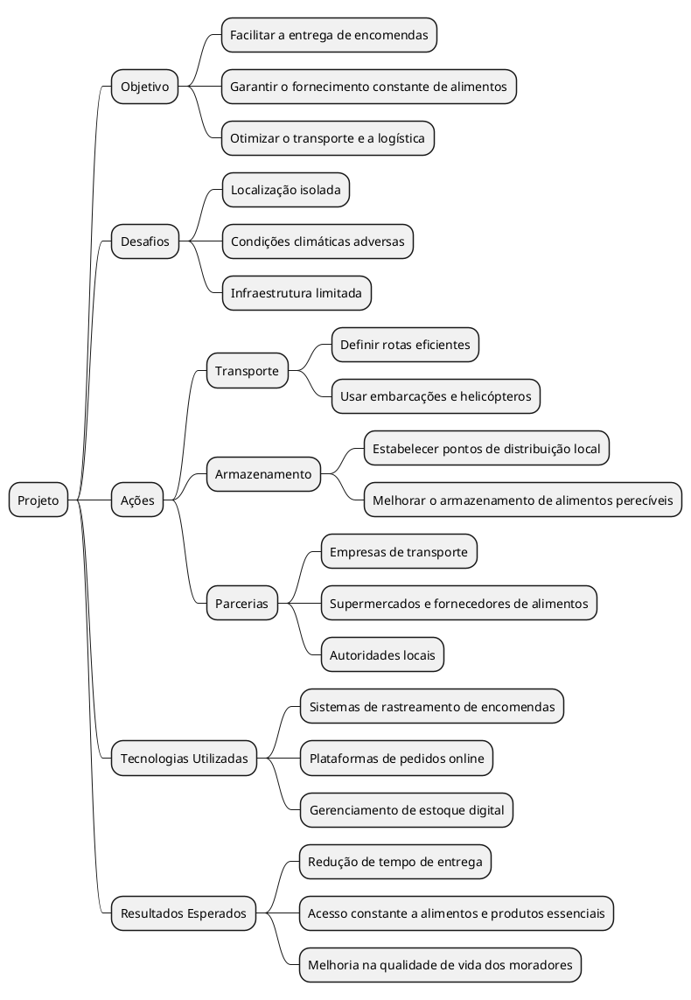

```plantuml
@startmindmap
* Projeto
** Objetivo
*** Facilitar a entrega de encomendas
*** Garantir o fornecimento constante de alimentos
*** Otimizar o transporte e a logística
** Desafios
*** Localização isolada
*** Condições climáticas adversas
*** Infraestrutura limitada
** Ações
*** Transporte
**** Definir rotas eficientes
**** Usar embarcações e helicópteros
*** Armazenamento
**** Estabelecer pontos de distribuição local
**** Melhorar o armazenamento de alimentos perecíveis
*** Parcerias
**** Empresas de transporte
**** Supermercados e fornecedores de alimentos
**** Autoridades locais
** Tecnologias Utilizadas
*** Sistemas de rastreamento de encomendas
*** Plataformas de pedidos online
*** Gerenciamento de estoque digital
** Resultados Esperados
*** Redução de tempo de entrega
*** Acesso constante a alimentos e produtos essenciais
*** Melhoria na qualidade de vida dos moradores
@endmindmap
```